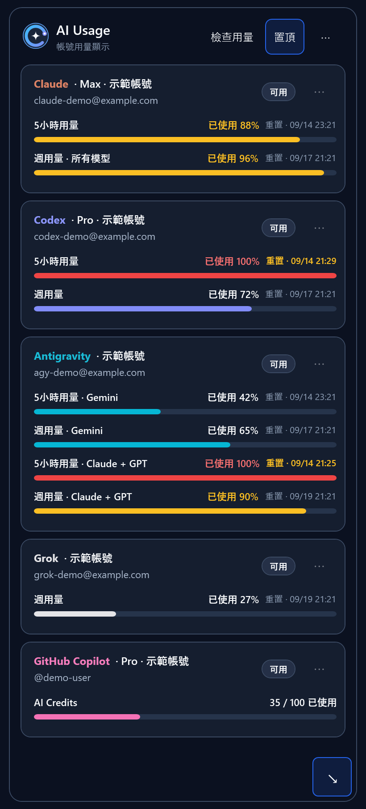
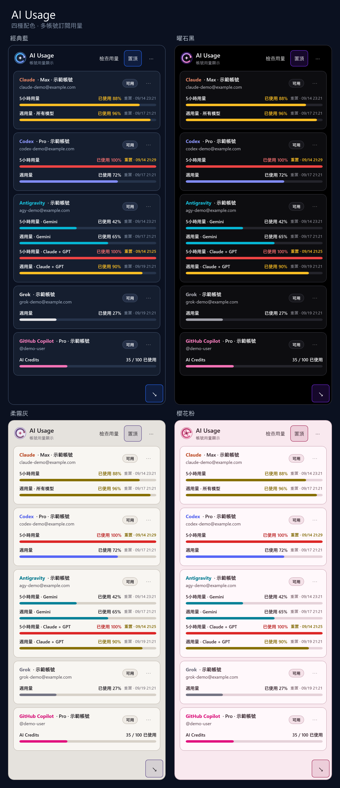

<h1 align="center">AI Usage Dashboard</h1>

  AI Usage 是 Windows 桌面工具，可在同一個浮窗查看多個 AI 服務的訂閱用量。

  
  
  

  

查看四種主題的完整預覽

  

## 目前版本

目前正式版本為 **`1.0.10`**。Grok 會顯示經驗證、且符合目前卡片帳號的訂閱方案；GitHub Copilot 僅顯示已驗證的方案，並使用可讀的方案名稱。本版沿用前一正式版已簽署的 Updater，維持 `1.0.8` 版號與原始位元組。從 [v1.0.10 GitHub Release](https://github.com/Sokaka/ai-usage-dashboard/releases/tag/v1.0.10) 下載；成品資訊見 [1.0.10 版本說明](docs/releases/1.0.10.md)。

`1.0.10` 的候選 workflow attempt 1 通過 4,286 項自動測試，production line coverage 為 74.49%。正式公開後，已匿名下載並核對六件原凍結成品、三份 sidecar 與 latest stable feed 的簽章。實際官方 CLI 登入與用量、乾淨 Windows 安裝及本版完整線上更新仍待驗證。詳見[實作與驗證清單](IMPLEMENTATION_CHECKLIST.md#目前正式版本)及 [CLI 實測表](docs/CLI_COMPATIBILITY.md#1010)。

## 支援平台

| 平台 | 使用前準備 | 帳號卡片 |
| --- | --- | --- |
| Claude | 安裝官方 Claude Code | 多帳號；同帳號依不同組織分卡 |
| Codex | 安裝官方 Codex CLI | 多帳號；同帳號依不同工作區分卡 |
| GitHub Copilot | 安裝本機官方 Copilot CLI | 多帳號；同帳號限一張卡片 |
| Grok | 從 xAI 官方來源安裝 Grok Build CLI 至預設位置 | 多帳號；同帳號限一張卡片 |
| Antigravity | 安裝官方 Antigravity CLI | 限一個帳號 |

版本要求與實測狀態見 [CLI 相容性](docs/CLI_COMPATIBILITY.md)；帳號需求、官方工具安裝與登入步驟見[使用說明](使用說明.md)。

## 主要功能

| 日常需求 | 可以怎麼用 |
| --- | --- |
| 查看還能用多少 | 集中查看各帳號用量，切換已使用／剩餘顯示，並查看來源提供的重置時間。 |
| 更新剛用過的帳號 | 自動更新之外，也能手動檢查全部或單一帳號；暫時失敗時可保留上次資料並標示狀態。 |
| 檢查 App 新版本 | 啟動後自動檢查已簽署的更新清單，也可從系統匣手動檢查；標準安裝版符合條件時可選擇更新並重新啟動。 |
| 分清不同帳號 | 為卡片設定暱稱；Claude 可顯示組織，Codex 可顯示工作區。暫時不用的卡片可停止檢查。 |
| 排列常用卡片 | 手動調整順序，或依服務、5 小時及週用量的重置時間自動排序。 |
| 邊工作邊看用量 | 浮窗可置頂、移動、停靠角落及收合；隱藏後仍在背景更新，可從系統匣叫回。 |
| 調整閱讀方式 | 四種主題配色，可讓高度隨卡片數量調整；卡片較多時可捲動，也支援 Windows 高對比模式。 |
| 下次開機接著用 | 保留排序、主題與浮窗偏好；標準安裝版可選擇隨 Windows 登入啟動。 |
| 備份設定或換機 | 匯出卡片與顯示設定，匯入前可預覽；匯入後須重新連接帳號，符合條件時可還原匯入前設定。 |

操作位置見[日常用量與浮窗管理](使用說明.md#查看與管理用量)；備份與還原條件見[匯入與匯出設定](使用說明.md#匯入與匯出設定)。

## 環境需求

- 仍在 Microsoft 支援範圍內的 Windows x64 電腦，以及網路連線。
- 安裝包包含所需的 .NET 執行環境，不必另外安裝；各服務的官方 CLI 由使用者另行安裝。

## 安裝與第一次使用

從目前版本的 GitHub Release 選擇：

| 使用方式 | 下載檔案 | 啟動方式 |
| --- | --- | --- |
| **一般安裝：Updater** | `AiUsageDashboard-Updater-<version>-win-x64.exe` | Updater 也能首次安裝。以一般使用者權限執行，安裝後從開始選單搜尋 **AI Usage**；保留 Updater 供日後更新。 |
| **免安裝：完整 ZIP** | `AiUsageDashboard-<version>-win-x64.zip` | 完整解壓到新資料夾後，執行其中的 App；不要下載 GitHub 自動產生的 Source code ZIP。 |

`1.0.10` 隨附的 Updater 檔名仍是 `AiUsageDashboard-Updater-1.0.8-win-x64.exe`；請依 Release 上的實際檔名下載。

依[安裝與第一次啟動](使用說明.md#安裝與第一次啟動)操作、閱讀並接受適用條款，再新增帳號，透過服務的官方登入流程完成連接。

## 使用限制

使用前請留意：

- **相容性**：AI Usage 透過各服務的官方 CLI 或 SDK 取得用量。上游工具更新可能改變登入流程、通訊協定或回傳格式；若無法讀取，請核對 [CLI 相容性](docs/CLI_COMPATIBILITY.md)與支援版本。
- **Claude 查詢**：AI Usage 會透過 Claude Code 的 `/usage` 讀取額度。這類狀態檢查可能消耗少量 token；若已啟用 usage credits，也可能產生額外費用。連接前請閱讀[Claude 注意事項](使用說明.md#連接-claude-前必讀)。
- **本機資料**：帳號設定與上次用量保存在目前 Windows 使用者的電腦中。
- **匯出隱私**：匯出檔不含密碼或 token，但可能含電子郵件及暱稱，請存放在可信任位置。
- **Windows 安全**：自有 EXE 尚無 Authenticode 簽章，可能提示或受系統政策阻擋；更新清單的簽章不提供 Windows 已驗證發布者身分。不要關閉 SmartScreen 或安全防護。
- **服務條款**：各服務仍受供應商條款約束；Claude／Antigravity 的整合適用性尚未確認，詳見[發布限制](RELEASING.md#最後公開決策)。
- **舊版升級**：舊內部版本需手動升級一次，請使用原 Windows 使用者與原安裝位置，依[舊版升級說明](使用說明.md#從舊內部版升級)操作。

## 相關文件

| 需求 | 文件 |
| --- | --- |
| 一般使用、設定與問題排除 | [使用說明](使用說明.md) |
| 回報問題或提出功能建議 | [支援與問題回報](SUPPORT.md) |
| 私密回報安全問題 | [安全問題回報](SECURITY.md) |
| 架構、資料保存與服務串接 | [技術總覽](docs/TECHNICAL_OVERVIEW.md) |
| 開發規範與升級相容性要求 | [AGENTS.md](AGENTS.md) |
| 功能與驗收狀態 | [實作檢查清單](IMPLEMENTATION_CHECKLIST.md) |
| 安裝、更新、復原與解除安裝 | [Windows 分發與支援手冊](INTERNAL_DISTRIBUTION.md) |
| 版本發布與維護要求 | [發布流程](RELEASING.md) |

## 專案與授權

- **性質**：個人作品，與公司或各服務供應商無隸屬關係。
- **授權**：自有程式碼採 [MIT](LICENSE)，第三方元件沿用[各自的授權與 notices](third-party-notices/component-manifest.json)。
- **服務名稱**：僅用於說明相容性。
