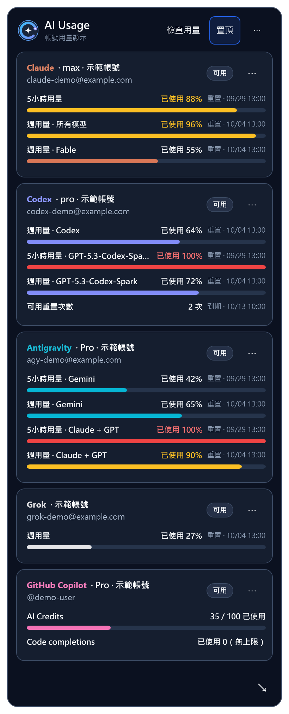
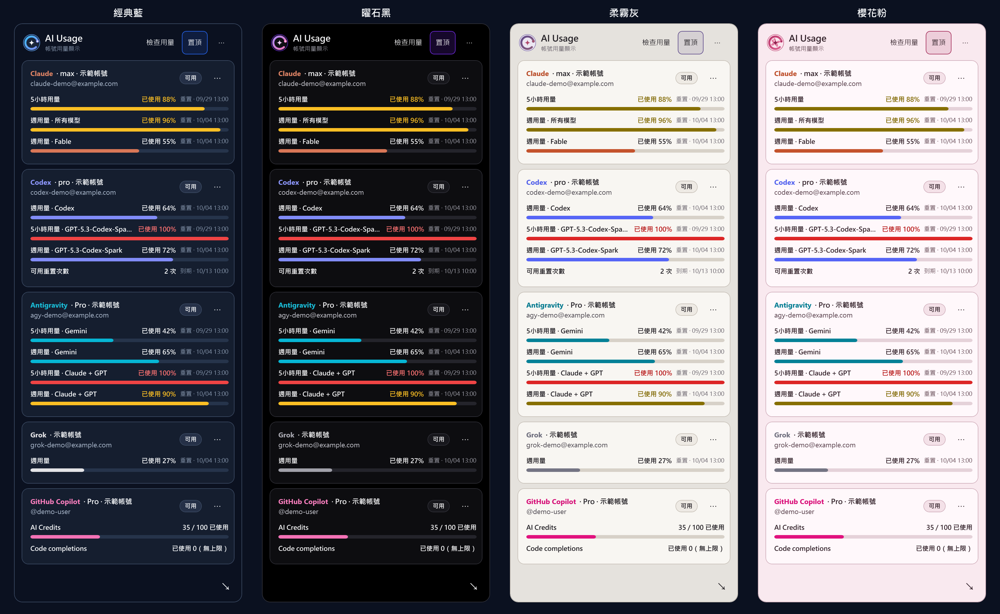

<h1 align="center">AI Usage Dashboard</h1>

  AI Usage is a Windows desktop app that shows subscription usage across AI services in a single floating widget.

  <strong>English</strong> | <a href="README.zh-TW.md">繁體中文</a>

  
  
  

  

Preview all four themes

  

The stable v1.0.15 download uses a Traditional Chinese interface. The current source adds
English (default) and Traditional Chinese, switchable from **⋯ → Language** or the tray menu;
the language setting is included in settings exports. Detailed guides and release notes remain
in Traditional Chinese. The instructions below include Chinese menu labels for the stable download.

## Current release

The current stable version is **`1.0.15`**. [Download](https://github.com/Sokaka/ai-usage-dashboard/releases/tag/v1.0.15) · [Release notes](docs/releases/1.0.15.md)

This release improves widget expansion and feedback when checking an account's usage,
with clearer account connection, settings import, and usage messages.

For a standard installation, choose **Check for updates** (`檢查更新`) from the system tray menu,
then follow the update prompt. New users can start with [Installation and first use](#installation-and-first-use).
See [Limitations and cautions](#limitations-and-cautions) for compatibility and safety notes.

## Supported services

Install the official CLI for each service you use:

| Service | Required official CLI | Account cards |
| --- | --- | --- |
| Claude | Claude Code | Multiple; split by organization |
| Codex | Codex CLI | Multiple; split by workspace |
| GitHub Copilot | Copilot CLI | Multiple; one card per account |
| Grok | Grok Build CLI | Multiple; one card per account |
| Antigravity | Antigravity CLI | One account |

Claude and Codex support separate cards for different organizations or workspaces under the same account.
Install Grok Build CLI from an official xAI source, in its default location.

See [CLI compatibility](docs/CLI_COMPATIBILITY.md) for version requirements and verification status.
Account requirements, official CLI installation, and sign-in steps are covered in the [User guide](使用說明.md).

## Main features

- **See what remains.** View usage across accounts, switch between used and remaining amounts,
  and see reset times provided by each service.
- **Refresh an account.** Alongside automatic updates, check all accounts or just one.
  If a check temporarily fails, the app can show the last reading with a status message.
- **Tell accounts apart.** Give cards nicknames, show Claude organizations or Codex workspaces,
  and pause usage checks for cards you are not using.
- **Keep your usual cards in order.** Arrange cards manually, or sort by service,
  5-hour reset time, or weekly reset time.
- **Watch usage while you work.** Keep the widget on top, move it, dock it in a corner,
  or collapse it. Usage updates continue while it is hidden; bring it back from the system tray.
- **Adjust the display.** Choose from four themes, let the widget adjust its height to fit your cards,
  and scroll through longer lists. Windows High Contrast mode is supported.
- **Pick up where you left off.** Keep your sorting, theme, and widget preferences.
  Standard installations can optionally start when you sign in to Windows.
- **Back up settings or move to another PC.** Export cards and display settings, preview imports,
  and reconnect accounts after importing. Previous settings can be restored while the restore option is available.

See [Usage and widget controls](使用說明.md#查看與管理用量) for operation details,
and [Importing and exporting settings](使用說明.md#匯入與匯出設定) for backup and restore conditions.

## Requirements

- A Windows x64 PC running a version still supported by Microsoft, with an internet connection.
- The package includes the required .NET runtime. Install each service's official CLI separately.

## Installation and first use

Choose a download from the current version's GitHub Release:

1. **Standard installation: Updater.** Download `AiUsageDashboard-Updater-<version>-win-x64.exe`.
   The Updater also handles first-time installation. Run it as a regular user, then search for
   **AI Usage** in the Windows Start menu. Keep the Updater for future updates.
2. **Portable: full ZIP.** Download `AiUsageDashboard-<version>-win-x64.zip`, extract the entire
   archive into a new folder. Open the extracted `AiUsageDashboard` folder, then run
   `app\AiUsageDashboard.App.exe`.
   Do not download GitHub's automatically generated **Source code** ZIP.

For App `1.0.15`, the Updater file is `AiUsageDashboard-Updater-1.0.12-win-x64.exe`.
Use the actual filename listed on the Release page; the Updater version can differ from the app version.

Follow [Installation and first launch](使用說明.md#安裝與第一次啟動), read and accept the applicable terms,
then choose **Add account** (`新增帳號`) and connect through the service's official sign-in flow.

## Limitations and cautions

- **Compatibility.** AI Usage reads usage through official CLIs or SDKs. Upstream updates can
  change sign-in flows, protocols, or response formats. If usage cannot be read, check
  [CLI compatibility](docs/CLI_COMPATIBILITY.md) and the supported versions.
- **Claude usage checks.** AI Usage reads quotas through Claude Code's `/usage`.
  These checks may consume a small number of tokens and may incur additional charges if usage credits
  are enabled. Read the [Claude cautions](使用說明.md#連接-claude-前必讀) before connecting.
- **Local data.** Account settings and the last usage readings are stored on the current Windows user's PC.
- **Export privacy.** Exported settings exclude passwords and tokens, but may include email addresses
  and nicknames. Store them in a trusted location.
- **Windows security.** AI Usage's EXE files are not Authenticode-signed and may trigger warnings
  or be blocked by system policies. The update feed signature does not establish a Windows-verified
  publisher identity. Do not disable SmartScreen or other security protections.
- **Provider terms.** Each service's provider terms still apply. Compliance of the Claude and Antigravity
  integrations with those terms has not been confirmed; see [Release restrictions](RELEASING.md#最後公開決策).
- **Upgrading old internal builds.** These builds require a one-time manual upgrade. Use the original
  Windows user and installation location, and follow the [Upgrade instructions](使用說明.md#從舊內部版升級).

## Related documentation

- [User guide](使用說明.md): everyday use, settings, and troubleshooting.
- [Support and issue reporting](SUPPORT.md): report problems or suggest features.
- [Security reporting](SECURITY.md): report security issues privately.
- [Technical overview](docs/TECHNICAL_OVERVIEW.md): architecture, storage, and service integrations.
- [Development guidelines](AGENTS.md): coding rules and upgrade compatibility requirements.
- [Implementation checklist](IMPLEMENTATION_CHECKLIST.md): feature and verification status.
- [Windows distribution and support](INTERNAL_DISTRIBUTION.md): installation, updates, recovery, and removal.
- [Release process](RELEASING.md): publishing and maintaining releases.

## Project and license

- **Independent project.** A personal project, unaffiliated with any company or service provider.
- **License.** Project code is licensed under [MIT](LICENSE). Third-party components retain
  their [own licenses and notices](third-party-notices/component-manifest.json).
- **Service names.** Used only to describe compatibility.
